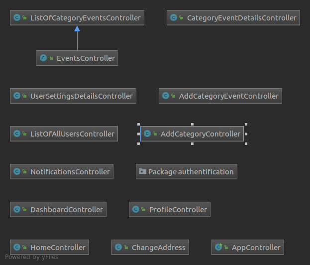
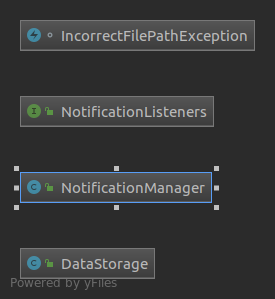
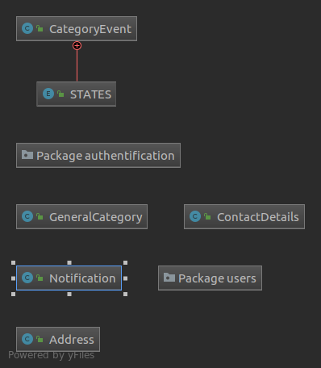
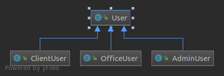

# Blažej Rypák

# Smart city
Projekt Smart City je určený na efektívnejšiu komunikáciu medzi občanom a jeho
samosprávou v oblasti podávania rôznych podnetov zo strany občanov a opätovnom
získavani notifikácií po ich úspešnom vyriešení.

### Občan:
- Prostredníctvom aplikácie Smart City občan jednoduchšie prispieva na kvalite života
v jeho meste, a to tak že dáva podnety na rôzne nedostatky, ktoré je potrebné
odstrániť.
- Napríklad nefunkčné osvetlenie na ulici, poškodená lavička v parku, nevysypaný kôš
alebo výtlk na ceste.
- Následne keď sa problém vyrieši občan je notifikovaný správou.
- Občan v aplikácii zvolí konkrétny nedostatok, napíše k nemu potrebný popis, pridá
lokalizáciu miesta a odošle svojej samospráve.

### Mesto:
- Mesto v aplikácii vidí všetky podnety zvoleného typu podnetu.
- Podnet vo forme správy sa dostane k príslušnému uradnikovi, ktorý je zodpovedný
za danú oblasť.
- Po jeho vyriešení sa automaticky pošle notifikácia každému občanovi, ktorý podnet
podal alebo sa oň zaujímal.

## Funkcionalita: 
**Občan** po prihlásení môže pridať nový podnet podľa zvolenej kategórie, pozrieť si notifikácie o podnetoch,
 ktorým sa zmenil stav.

**Úradnik** si po prihlásení môže pozrieť všetky podnety podľa zvolenej kategórie, zmeniť stav daného podnetu,
 pozrieť všetky notifikácie alebo pridať novú kategóriu.

- agregácia: trieda Address je agregovaná v triedach: CategoryEvent a ContactDetails

- dedenie: trieda AdminUser dedí triedu User

- polymorfizmus: metóda update() z interfacu NotificationListeners v triedach ClientUser a OfficeUser 
je rôzne implementovaná. (Observer pattern)

## Kriteriá
###   Návrhové vzory:
- Observer v baliku helpers, používam na posielanie notifikácií:
    - Občan pošle nový podnet, uradníkovi príde notifikácia
    - Uradník zmení stav podnetu, občanovy, ktorý poslal podnet a všetkým ktorí dali sledovať príde notífikácia
- Singleton použitý pre DataStorage.java

### Vlastné výnimky
- IncorrectFilePathException vráti error správu keď sa zadám nesprávnu cestu k JSON súboru
    - používam v DataStorage na [riadku](https://github.com/OOP-FIIT/oop-2019-uto-18-b-kanuch-blazejrypak/blob/master/src/helpers/DataStorage.java#L271)

### Manuálne vytvorené handlers:
- v EventsController na [riadku](https://github.com/OOP-FIIT/oop-2019-uto-18-b-kanuch-blazejrypak/blob/master/src/controllers/EventsController.java#L24)
  
### Použitie generickosti
- v DataStorage na [riadku](https://github.com/OOP-FIIT/oop-2019-uto-18-b-kanuch-blazejrypak/blob/master/src/helpers/DataStorage.java#L76)

### Použitie vhniezdenej triedy
- použil som **Enum** v CategoryEvent, na [riadku](https://github.com/OOP-FIIT/oop-2019-uto-18-b-kanuch-blazejrypak/blob/master/src/models/CategoryEvent.java#L28)

### Použitie lambda výrazov 
- používal som ich v GUI:
    - napríklad v CategoryEventDetailsController na [riadku](https://github.com/OOP-FIIT/oop-2019-uto-18-b-kanuch-blazejrypak/blob/master/src/controllers/CategoryEventDetailsController.java#L104) 

# UML Diagramy
- UML Diagram pre balík controllers
 

- UML Diagram pre balík helpers
 

- UML Diagram pre balík models
 

- UML Diagram pre balík users
    

# Zmeny od poslednej prezentovanej verzie
- Funkcionalita:
    - Pridané: **Občan** môže začat sledovať akýkoľvek podnet, a to dvojitým kliknutím na **návrh** v Dashboard/Events
    - Pridaná možnosť Admin používateľovi, aby mohol zmeňit ľubovoľnému použivateľovi typ jeho roly
    - Pridaná možnosť každému použivateľovi, aby si mohol zmeniť jeho adresu
    - Pridaný dátum do každej notifikácie
    - Pridal som vlastnú výnimku, popísana vyšie
- GUI
    - Rozdelil som podľa typu použiváteľa zobrazenie tlačitiel na DashBoard-e

# Getting Started
- change absolute path in helpers/DataStorage.java to:
    - private String USERS = "/**yourAbsolutePath**/src/helpers/users";
    - private String CATEGORIES = "/**yourAbsolutePath**/src/helpers/categories";
    - example: private String USERS = "/home/bubo/IdeaProjects/SmartCityFinal/src/helpers/users";

- install libraries in prerequisites below

# Prerequisites:
- Java 1.8.0
- JFoenix 8.x.x from https://github.com/jfoenixadmin/JFoenix
- json-simple-1.1.1.jar from https://code.google.com/archive/p/json-simple/downloads

## Accounts for testing
- Admin
    - username: **root**
    - password: **root**
    
- Officer
    - username: **officer**
    - password: **officer**
    
- Citizen
    - username: **client**
    - password: **client**
    
- Citizen
    - username: **citizen**
    - password: **citizen**
    
    